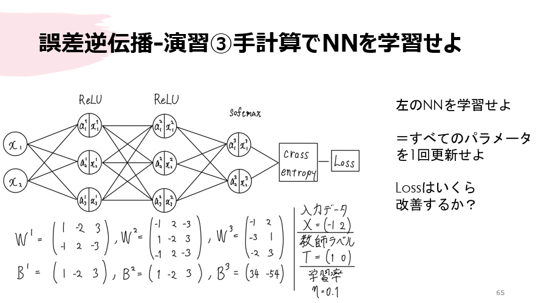

## 完成品

## 説明
#### グラフの見方
##### エッジの色：重みの正負
| 青 | 白 | 赤 |
| ---- | ---- | ---- |
| 負 | 0 | 正 |
##### エッジの太さ：重みの絶対値
| 細 | 太 |
| ---- | ---- |
| 小 | 大 |
##### ノードの色：バイアスの正負
| 青 | 白 | 赤 |
| ---- | ---- | ---- |
| 負 | 0 | 正 |
#### 学習する関数
学習している様子が分かりやすいよう，適当な定義域でほどよい凹凸がある関数を探したら以下の式にたどり着いた．

$$ f(x, y) = \sin\left(\sqrt{x^2 + y^2}\right) -4\cos\left(\frac{y}{3}\right) + \ln\left(1 + (x+y)^4\right)
\\ where ( -10 \leq x \leq 10 ) \land ( -10 \leq y \leq 10 )$$

#### 訓練データと教師データ
推測の対象が2変数関数なので，x,yからzを推定する回帰タスクとなる．ニューラルネットワークの形は2入力1出力になる．中間層の数や各層のノードの数は可変である．

訓練データは定義域内からランダムな点
$$(x,y) \in \mathbb{R}^2$$を数千個選び，学習させる関数に作用させzを計算し，教師データを作成した．

#### テストデータ
格子状に並んだ点
$$(x,y) \in \mathbb{R}^2$$を選び，学習済みのニューラルネットワークに適用する（推測する）．これと真の関数を重ねて表示している．

## 遊び方
#### Processingのインストール
[Processing](https://www.processing.org/)を用いてニューラルネットワークの設計や描画を行っている．これをインストールして，手元にコードを(**nn**のフォルダごと)インストールすればだれでも遊べる！
#### ファイルの置き方  
processing-4.3  
├── core  
├── java  
├── lib  
├── modes  
├── **nn**  
│   └── **nn.pde**  
│   └── **func.png**  
├── tools  
├── processing.exe  
└── processing-java.exe  

## 高専ゼミ「手計算ニューラルネットワーク」
元々は自分がニューラルネットワークを理解したいという気持ちから，高専時代の同級生に対してゼミを行った．どのように**学習**が行われているかを理解したかったので，手計算でニューラルネットワークを学習することを目標にしたゼミを行った．
seminar/slideに発表した資料がある．また，このゼミではC++でニューラルネットワークを実装したのでそれもseminar/hcnn4_classification-inside-circleにある．

この資料を見れば，手計算でこのニューラルネットワークを学習できるようになる．

#### 分類タスク
ゼミの中ではirisデータセットやKaggleのTitanicをC++で実装したこれらもseminarの中にコードを載せてある．

